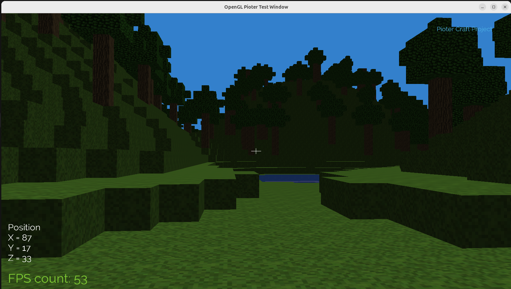
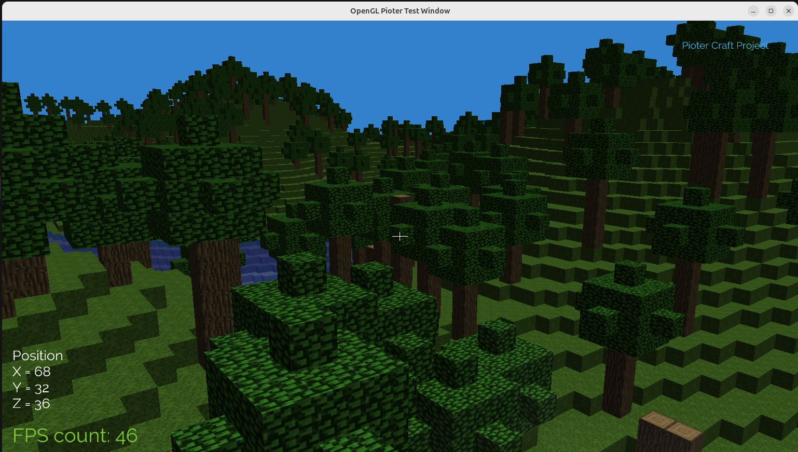
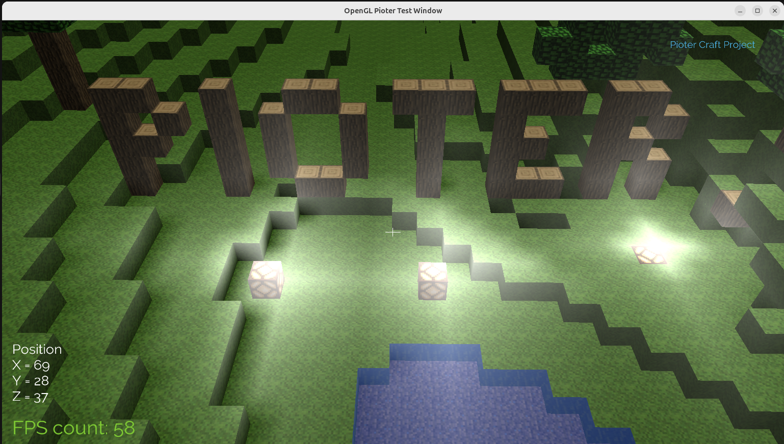

# PioterCraft

PioterCraft is a voxel-based game engine built using modern C++ and OpenGL. It provides a sandbox environment where users can explore, interact, and modify a procedurally generated world. The project demonstrates graphics rendering techniques, chunk management, and real-time updates.

This engine project evolved from the OpenGL tutorial available at [Learn OpenGL](https://learnopengl.com).

## Features

- **Procedural World Generation**: The game generates a voxel-based world dynamically, including terrain, trees and basic water.
- **Chunk Management**: Efficient loading, updating, and rendering of chunks to ensure smooth gameplay.
- **Lighting System**: Real-time basic light propagation and shading.
- **Camera and Raycasting**: A free-moving camera with raycasting.
- **Crosshair and Status Display**: On-screen elements like crosshair and FPS counter.
- **Texture Management**: Support for multiple textures to enhance the visual appeal of the game.
- **Shaders**: Includes vertex and fragment shaders for rendering cubes, fonts, and crosshairs.

## Screenshots

Below are some screenshots showcasing running engine:







## Disclaimer

I am not the author or owner of any of the files inside the following directories:
- `PioterCraft/external`
- `PioterCraft/textures`
- `PioterCraft/fonts`

These files are used for development purposes and belong to their respective authors.

## Build Instructions

1. Clone the repository:
   ```bash
   git clone <repository-url>
   cd PioterCraft
   ```

2. Create a build directory and navigate to it:
   ```bash
   mkdir build
   cd build
   ```

3. Run CMake to configure the project:
   ```bash
   cmake ..
   ```

4. Build the project:
   ```bash
   make -j$(nproc)
   ```

5. Run the executable:
   ```bash
   ./PioterCraft
   ```

## Dependencies

To run the project successfully on Linux, the following dependencies need to be installed:

### System Dependencies
- OpenGL
- GLFW3
- FreeType
- Assimp
- CMake (minimum version 3.5.0)

You can install these dependencies using your package manager. For example, on Ubuntu:
```bash
sudo apt-get install libglfw3-dev libfreetype6-dev libassimp-dev cmake
```

### External Dependencies
The project also uses the following external libraries:
- `glad` (OpenGL loader)
- `glm` (Mathematics library for graphics applications)
- `FastNoiseLite` (Noise generation library)
- `stb_image` (Image loading library)

These libraries are included in the `PioterCraft/external` directory and do not require separate installation.

---

Feel free to reach out if you have any questions or suggestions!
